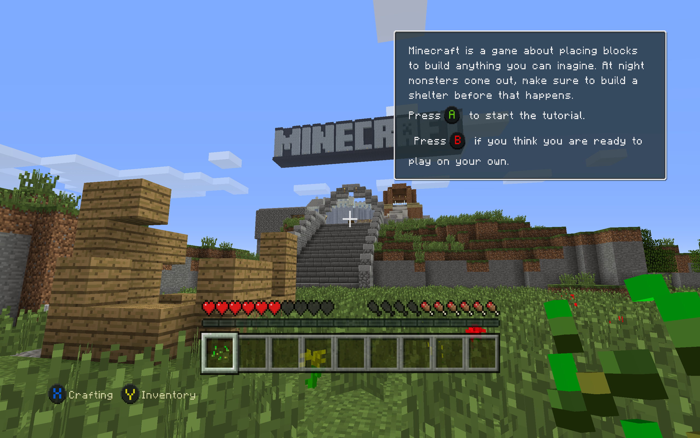

# MinecraftConsoles

[](https://discord.gg/jrum7HhegA)



## Introduction

This project contains the source code of Minecraft Legacy Console Edition v1.6.0560.0 (TU19) with some fixes and improvements applied.

## Download
Windows users can download our [Nightly Build](https://github.com/smartcmd/MinecraftConsoles/releases/tag/nightly)! Simply download the `.zip` file and extract it to a folder where you'd like to keep the game. You can set your username in `username.txt` (you'll have to make this file) and add servers to connect to in `servers.txt`

## Platform Support

- **Windows**: Supported for building and running the project
- **macOS / Linux**: The Windows nightly build may run through Wine or CrossOver based on community reports, but this is unofficial and not currently tested by the maintainers

## Features

- Skin with flag: Steve → Steve model + 64x64 UV

- Skin with flag: Alex → Alex model + 64x64 UV

- Skin without flag → Classic Steve model + 64x32 UV

- UI preview shows each skin correctly

- The menu no longer crashes the game

## Build & Run

1. Install [Visual Studio 2022](https://aka.ms/vs/17/release/vs_community.exe).
2. Clone the repository.
3. Open the project by double-clicking `MinecraftConsoles.sln`.
4. Make sure `Minecraft.Client` is set as the Startup Project.
5. Set the build configuration to **Debug** (Release is also OK but has some bugs) and the target platform to **Windows64**, then build and run.

### CMake (Windows x64)

```powershell
cmake -S . -B build -G "Visual Studio 17 2022" -A x64
cmake --build build --config Debug --target MinecraftClient
```

For more information, see [COMPILE.md](COMPILE.md).

## Known Issues

- Native builds for platforms other than Windows have not been tested and are most likely non-functional. The Windows nightly build may still run on macOS and Linux through Wine or CrossOver, but that path is unofficial and not currently supported

## Contributors
Would you like to contribute to this project? Please read our [Contributor's Guide](CONTRIBUTING.md) before doing so! This document includes our current goals, standards for inclusions, rules, and more.
